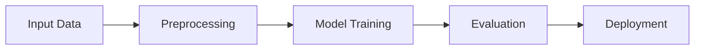

# Complete Guide: MkDocs + MathJax Setup for GitHub Projects

**Purpose:** Set up professional documentation with LaTeX math rendering for any Python/research project  
**Problem:** GitHub's markdown doesn't render LaTeX equations properly  
**Solution:** MkDocs + Material theme + MathJax = Beautiful documentation site  
**Last Updated:** 2026-01-24

---

## Table of Contents

1. [Overview](#overview)
2. [Why MkDocs + MathJax?](#why-mkdocs--mathjax)
3. [Prerequisites](#prerequisites)
4. [Quick Start](#quick-start)
5. [Detailed Setup](#detailed-setup)
6. [Configuration Files](#configuration-files)
7. [Local Testing](#local-testing)
8. [GitHub Deployment](#github-deployment)
9. [Writing Documentation](#writing-documentation)
10. [Troubleshooting](#troubleshooting)
11. [Examples](#examples)

---

## Overview

This guide shows you how to set up a **professional documentation site** with **LaTeX math rendering** for any GitHub project.

**What you get:**
- Beautiful LaTeX math: `$E = mc^2$` → $E = mc^2$
- Professional theme with dark mode
- Auto-deployment: push to main → site updates
- Full-text search
- Mobile-responsive
- Free hosting on GitHub Pages

**Time to complete:** 15-20 minutes

---

## Why MkDocs + MathJax?

### The Problem

GitHub's markdown renderer has poor LaTeX support:

```markdown
# On GitHub
The ALS update is: x_u = (Y C_u Y^T + \lambda I)^{-1} Y C_u r_u
```

**Result:** Shows as raw text, completely unreadable for complex equations ❌

### The Solution

**MkDocs + MathJax** renders equations beautifully:

```markdown
# With MkDocs + MathJax
$$
x_u = (Y C_u Y^T + \lambda I)^{-1} Y C_u r_u
$$
```

**Result:** Professional typeset equations ✅

### Comparison

| Feature | GitHub Markdown | MkDocs + MathJax |
|---------|-----------------|------------------|
| LaTeX rendering | ❌ Poor | ✅ Excellent |
| Math quality | ❌ Raw text | ✅ Typeset |
| Theme customization | ❌ None | ✅ Full control |
| Dark mode | ❌ Limited | ✅ Native |
| Search | ❌ Basic | ✅ Advanced |
| Mobile-friendly | ⚠️ OK | ✅ Optimized |
| Auto-deploy | ❌ Manual | ✅ GitHub Actions |

---

## Prerequisites

### Required

1. **Python 3.8+** (check: `python --version`)
2. **Git** (check: `git --version`)
3. **GitHub account** with repository
4. **Conda/Mamba** (recommended) or pip

### Recommended

- Code editor (VS Code, Cursor, etc.)
- Basic familiarity with:
  - Markdown
  - Git/GitHub
  - Terminal/command line

---

## Quick Start

**For the impatient - minimal working setup:**

```bash
# 1. Create requirements file
cat > requirements-docs.txt << 'EOF'
mkdocs>=1.5.3
mkdocs-material>=9.5.3
pymdown-extensions>=10.7
mkdocs-jupyter>=0.24.6
EOF

# 2. Install
pip install -r requirements-docs.txt

# 3. Initialize MkDocs
mkdocs new .

# 4. Replace mkdocs.yml with minimal config (see below)

# 5. Create MathJax config
mkdir -p docs/javascripts
# (Copy mathjax.js from Configuration Files section)

# 6. Test locally
mkdocs serve

# 7. Deploy to GitHub
mkdocs gh-deploy
```

**Then proceed to [GitHub Deployment](#github-deployment) for automatic updates.**

---

## Detailed Setup

### Step 1: Project Structure

Your project should have this structure:

```
your-project/
├── docs/                   # Documentation source
│   ├── index.md           # Landing page
│   ├── methods/           # Your content
│   ├── javascripts/       # MathJax config
│   └── stylesheets/       # Custom CSS
├── mkdocs.yml             # MkDocs configuration
├── requirements-docs.txt  # Documentation dependencies
├── .github/
│   └── workflows/
│       └── docs.yml       # Auto-deployment workflow
├── README.md              # Project README
└── [your code files]
```

### Step 2: Create Requirements File

Create `requirements-docs.txt` in project root:

```txt
# Documentation build requirements
mkdocs>=1.5.3
mkdocs-material>=9.5.3
pymdown-extensions>=10.7
mkdocs-jupyter>=0.24.6  # Optional: Jupyter notebook support
```

**Install dependencies:**

```bash
# Option 1: Using conda/mamba (recommended)
mamba activate your-env
pip install -r requirements-docs.txt

# Option 2: Using pip in virtual environment
python -m venv venv
source venv/bin/activate  # Windows: venv\Scripts\activate
pip install -r requirements-docs.txt
```

### Step 3: Create Directory Structure

```bash
# Create necessary directories
mkdir -p docs/javascripts
mkdir -p docs/stylesheets
mkdir -p .github/workflows

# Create initial docs
touch docs/index.md
```

### Step 4: Copy Documentation Files

You'll create these files (detailed in next section):

1. `mkdocs.yml` - Main configuration
2. `docs/javascripts/mathjax.js` - MathJax setup
3. `docs/stylesheets/extra.css` - Custom styling
4. `.github/workflows/docs.yml` - Auto-deployment
5. `docs/index.md` - Landing page

---

## Configuration Files

### File 1: `mkdocs.yml`

**Location:** Project root

```yaml
site_name: Your Project Name
site_description: Brief description of your project
site_author: Your Name
site_url: https://your-github-username.github.io/your-repo-name/

repo_name: your-github-username/your-repo-name
repo_url: https://github.com/your-github-username/your-repo-name
edit_uri: edit/main/docs/

copyright: Copyright &copy; 2026 Your Name

# Theme configuration
theme:
  name: material
  language: en
  palette:
    # Light mode
    - media: "(prefers-color-scheme: light)"
      scheme: default
      primary: indigo
      accent: indigo
      toggle:
        icon: material/brightness-7
        name: Switch to dark mode
    # Dark mode
    - media: "(prefers-color-scheme: dark)"
      scheme: slate
      primary: indigo
      accent: indigo
      toggle:
        icon: material/brightness-4
        name: Switch to light mode
  font:
    text: Roboto
    code: Roboto Mono
  features:
    - navigation.instant        # Instant loading
    - navigation.tracking       # Anchor tracking
    - navigation.tabs           # Top-level navigation tabs
    - navigation.tabs.sticky    # Sticky tabs
    - navigation.sections       # Section navigation
    - navigation.expand         # Expand sections
    - navigation.top            # Back to top button
    - search.suggest            # Search suggestions
    - search.highlight          # Highlight search results
    - content.code.copy         # Copy button for code blocks
    - content.action.edit       # Edit button
  icon:
    repo: fontawesome/brands/github
    edit: material/pencil

# Extensions
markdown_extensions:
  # Python Markdown
  - abbr
  - admonition
  - attr_list
  - def_list
  - footnotes
  - md_in_html
  - tables
  - toc:
      permalink: true
      toc_depth: 3
  
  # Python Markdown Extensions (pymdownx)
  - pymdownx.arithmatex:
      generic: true
  - pymdownx.betterem:
      smart_enable: all
  - pymdownx.caret
  - pymdownx.details
  - pymdownx.emoji:
      emoji_index: !!python/name:material.extensions.emoji.twemoji
      emoji_generator: !!python/name:material.extensions.emoji.to_svg
  - pymdownx.highlight:
      anchor_linenums: true
      line_spans: __span
      pygments_lang_class: true
  - pymdownx.inlinehilite
  - pymdownx.keys
  - pymdownx.mark
  - pymdownx.smartsymbols
  - pymdownx.superfences:
      custom_fences:
        - name: mermaid
          class: mermaid
          format: !!python/name:pymdownx.superfences.fence_code_format
  - pymdownx.tabbed:
      alternate_style: true
  - pymdownx.tasklist:
      custom_checkbox: true
  - pymdownx.tilde

# Extra JavaScript for MathJax
extra_javascript:
  - javascripts/mathjax.js
  - https://polyfill.io/v3/polyfill.min.js?features=es6
  - https://cdn.jsdelivr.net/npm/mathjax@3/es5/tex-mml-chtml.js

# Extra CSS
extra_css:
  - stylesheets/extra.css

# Plugins
plugins:
  - search:
      lang: en
      separator: '[\s\-\.]+'
  - tags
  - mkdocs-jupyter:
      include_source: True
      execute: False
      allow_errors: False
      ignore_h1_titles: True
      theme: light
      include_requirejs: True
      show_input: True
      no_input: False

# Navigation structure (customize for your project)
nav:
  - Home: index.md
  - Getting Started:
      - Installation: installation.md
      - Quick Start: quickstart.md
  - Documentation:
      - Overview: docs/overview.md
      - Your sections here...

# Extra configuration
extra:
  social:
    - icon: fontawesome/brands/github
      link: https://github.com/your-github-username/your-repo-name
  version:
    provider: mike
```

**Important customizations:**
- Replace `Your Project Name`, `your-github-username`, `your-repo-name`
- Update `nav` section with your actual documentation structure
- Choose color: `primary: indigo` (or deep-purple, blue, teal, etc.)

---

### File 2: `docs/javascripts/mathjax.js`

**Location:** `docs/javascripts/mathjax.js`

```javascript
window.MathJax = {
  tex: {
    inlineMath: [['$', '$'], ["\\(", "\\)"]],
    displayMath: [['$$', '$$'], ["\\[", "\\]"]],
    processEscapes: true,
    processEnvironments: true,
    tags: 'ams'
  },
  options: {
    ignoreHtmlClass: 'tex2jax_ignore',
    processHtmlClass: 'tex2jax_process|arithmatex'
  },
  startup: {
    pageReady() {
      return MathJax.startup.defaultPageReady().then(() => {
        console.log('MathJax initial typesetting complete');
      });
    }
  }
};

// Re-render math when new content loads (for MkDocs Material theme)
document$.subscribe(() => { 
  MathJax.typesetPromise().catch((err) => console.log('MathJax typeset error:', err));
})
```

**What this does:**
- Enables `$...$` for inline math
- Enables `$$...$$` for display math
- Auto-re-renders when navigating between pages
- Uses AMS math packages (align, equation, etc.)

---

### File 3: `docs/stylesheets/extra.css`

**Location:** `docs/stylesheets/extra.css`

```css
/* Custom styles for documentation */

/* Make math expressions stand out slightly */
.arithmatex {
  font-size: 1.05em;
}

/* Improve code block appearance */
.highlight {
  margin: 1em 0;
}

/* Better spacing for admonitions */
.admonition {
  margin: 1.5em 0;
}

/* Improve table appearance */
table {
  width: 100%;
  margin: 1.5em 0;
}

/* Better footnote styling */
.footnote {
  font-size: 0.9em;
  color: var(--md-default-fg-color--light);
}

/* Mermaid diagram centering */
.mermaid {
  text-align: center;
  margin: 2em 0;
}

/* Badge styling */
.badge {
  display: inline-block;
  padding: 0.25em 0.5em;
  border-radius: 3px;
  font-size: 0.85em;
  font-weight: 600;
}
```

---

### File 4: `.github/workflows/docs.yml`

**Location:** `.github/workflows/docs.yml`

```yaml
name: Deploy Documentation

on:
  push:
    branches:
      - main
  workflow_dispatch:

permissions:
  contents: write

jobs:
  deploy:
    runs-on: ubuntu-latest
    steps:
      - uses: actions/checkout@v4

      - name: Set up Python
        uses: actions/setup-python@v5
        with:
          python-version: '3.10'

      - name: Cache dependencies
        uses: actions/cache@v3
        with:
          path: ~/.cache/pip
          key: ${{ runner.os }}-pip-${{ hashFiles('requirements-docs.txt') }}
          restore-keys: |
            ${{ runner.os }}-pip-

      - name: Install dependencies
        run: |
          pip install -r requirements-docs.txt

      - name: Build documentation
        run: mkdocs build

      - name: Deploy to GitHub Pages
        uses: peaceiris/actions-gh-pages@v3
        with:
          github_token: ${{ secrets.GITHUB_TOKEN }}
          publish_dir: ./site
          publish_branch: gh-pages
          force_orphan: true
```

**What this does:**
- Triggers on every push to `main` branch
- Installs documentation dependencies
- Builds the site
- Deploys to `gh-pages` branch
- Takes 2-3 minutes

---

### File 5: `docs/index.md`

**Location:** `docs/index.md`

```markdown
# Your Project Name

Welcome to the documentation for **Your Project Name**.

## Overview

Brief description of what your project does and why it's useful.

## Features

- ✅ Feature 1
- ✅ Feature 2
- ✅ Feature 3

## Quick Start

```bash
# Installation
pip install your-package

# Basic usage
python example.py
```

## Example with Math

The fundamental equation is:

$$
E = mc^2
$$

For inline math, use single dollar signs: $\alpha + \beta = \gamma$

## Navigation

- [Installation Guide](installation.md)
- [User Guide](user-guide.md)
- [API Reference](api-reference.md)
```

---

### File 6: `.gitignore` (Update)

**Add to your `.gitignore`:**

```gitignore
# MkDocs build output
site/
docs/_build/
```

---

## Local Testing

### Start Development Server

```bash
# Navigate to project root
cd your-project/

# Activate environment (if using conda/mamba)
mamba activate your-env

# Start server with live reload
mkdocs serve
```

**Output:**
```
INFO     -  Building documentation...
INFO     -  Cleaning site directory
INFO     -  Documentation built in 2.15 seconds
INFO     -  [15:30:42] Watching paths for changes: 'docs', 'mkdocs.yml'
INFO     -  [15:30:42] Serving on http://127.0.0.1:8000/
```

**Open browser:** http://127.0.0.1:8000/

### Live Reload

**Any change to `.md` files automatically refreshes the browser!**

```bash
# Edit docs/index.md
vim docs/index.md

# Browser auto-refreshes with new content
# No need to restart server
```

### Build Static Site

```bash
# Build to site/ directory
mkdocs build

# Check output
ls site/

# Preview built site
cd site && python -m http.server 8000
```

### Validate Build

```bash
# Build in strict mode (fails on warnings)
mkdocs build --strict

# Useful for CI/CD to catch errors
```

---

## GitHub Deployment

### Method 1: Manual First Deployment

**Step 1: Build and deploy manually (one-time)**

```bash
# Build and push to gh-pages branch
mkdocs gh-deploy

# This creates gh-pages branch and pushes site
```

**Step 2: Configure GitHub Pages**

1. Go to: `https://github.com/your-username/your-repo/settings/pages`
2. **Source:** "Deploy from a branch"
3. **Branch:** Select `gh-pages`
4. **Folder:** `/ (root)`
5. Click "Save"

**Step 3: Wait 5-10 minutes**

Site will be live at: `https://your-username.github.io/your-repo/`

---

### Method 2: Automatic Deployment (Recommended)

**Once GitHub Pages is configured, automatic deployment works:**

```bash
# 1. Make changes to documentation
vim docs/your-file.md

# 2. Commit and push
git add docs/your-file.md
git commit -m "Update documentation"
git push origin main

# 3. GitHub Actions automatically:
#    - Builds site
#    - Deploys to gh-pages
#    - Updates live site (2-3 minutes)
```

**Monitor deployment:**
```
https://github.com/your-username/your-repo/actions
```

---

### Deployment Workflow

```
┌─────────────────────┐
│  Edit docs/*.md     │
│  on local machine   │
└──────────┬──────────┘
           │
           ▼
┌─────────────────────┐
│  git push origin    │
│  main               │
└──────────┬──────────┘
           │
           ▼
┌─────────────────────┐
│  GitHub Actions     │
│  Workflow Triggered │
└──────────┬──────────┘
           │
           ▼
┌─────────────────────┐
│  mkdocs build       │
│  (in cloud)         │
└──────────┬──────────┘
           │
           ▼
┌─────────────────────┐
│  Deploy to          │
│  gh-pages branch    │
└──────────┬──────────┘
           │
           ▼
┌─────────────────────┐
│  Site live!         │
│  (2-3 minutes)      │
└─────────────────────┘
```

---

## Writing Documentation

### Math Rendering

#### Inline Math

```markdown
The quality metric $q$ is defined as PR-AUC when minority class < 20%.

The solution to $ax^2 + bx + c = 0$ is $x = \frac{-b \pm \sqrt{b^2 - 4ac}}{2a}$.
```

**Renders as:**

The quality metric $q$ is defined as PR-AUC when minority class < 20%.

---

#### Display Math

```markdown
The fundamental optimization objective is:

$$
\mathcal{L}(X, Y) = \rho \|R - XY^T\|_F^2 + (1-\rho) \sum_{(u,i) \in L} (r_{ui} - y_i)^2
$$
```

**Renders as:**

$$
\mathcal{L}(X, Y) = \rho \|R - XY^T\|_F^2 + (1-\rho) \sum_{(u,i) \in L} (r_{ui} - y_i)^2
$$

---

#### Multi-line Equations

```markdown
The ALS updates are:

$$
\begin{align}
x_u &= (Y C_u Y^T + \lambda I)^{-1} Y C_u r_u \\
y_i &= (X C_i X^T + \lambda I)^{-1} X C_i r_i
\end{align}
$$
```

**Renders as:**

$$
\begin{align}
x_u &= (Y C_u Y^T + \lambda I)^{-1} Y C_u r_u \\
y_i &= (X C_i X^T + \lambda I)^{-1} X C_i r_i
\end{align}
$$

---

#### Matrix Equations

```markdown
$$
\begin{bmatrix}
a_{11} & a_{12} \\
a_{21} & a_{22}
\end{bmatrix}
\begin{bmatrix}
x_1 \\
x_2
\end{bmatrix}
=
\begin{bmatrix}
b_1 \\
b_2
\end{bmatrix}
$$
```

---

### Code Blocks

#### Basic Code Block

````markdown
```python
import numpy as np

def compute_loss(X, Y, R):
    """Compute reconstruction loss."""
    return np.linalg.norm(R - X @ Y.T, 'fro') ** 2
```
````

---

#### Code with Line Numbers

````markdown
```python linenums="1"
def als_update(Y, C, r, lambda_reg):
    k, n = Y.shape
    YCY = Y @ C @ Y.T + lambda_reg * np.eye(k)
    YCr = Y @ C @ r
    return np.linalg.solve(YCY, YCr)
```
````

---

#### Code with Highlighting

````markdown
```python hl_lines="3 4"
def train_model(data):
    model = initialize()
    for epoch in range(100):  # This line is highlighted
        loss = model.fit(data)  # This line is highlighted
    return model
```
````

---

### Admonitions (Callout Boxes)

```markdown
!!! note "Important Note"
    This is something you should pay attention to.

!!! warning "Warning"
    Be careful with this operation.

!!! tip "Pro Tip"
    Here's a helpful suggestion.

!!! example "Example"
    ```python
    # Your example code
    result = compute(data)
    ```

!!! danger "Critical"
    This could break things!
```

---

### Tables

```markdown
| Algorithm | Time Complexity | Space Complexity |
|-----------|-----------------|------------------|
| ALS | $O(k^2n)$ | $O(kn)$ |
| SGD | $O(kn)$ | $O(kn)$ |
| PyTorch | $O(k^2n)$ | $O(kn)$ |
```

**Renders as:**

| Algorithm | Time Complexity | Space Complexity |
|-----------|-----------------|------------------|
| ALS | $O(k^2n)$ | $O(kn)$ |
| SGD | $O(kn)$ | $O(kn)$ |
| PyTorch | $O(k^2n)$ | $O(kn)$ |

---

### Mermaid Diagrams

````markdown

````

**Renders as a flowchart!**

---

### Links

```markdown
# Internal links (relative to docs/)
[Installation Guide](installation.md)
[API Reference](api/reference.md)

# External links
[Python Docs](https://docs.python.org/)

# Anchor links (same page)
[Jump to examples](#examples)
```

---

### Images

```markdown
# Local image


# External image


# With caption
<figure>
  
  <figcaption>Figure 1: Experimental results</figcaption>
</figure>
```

---

### Tabs

```markdown
=== "Python"
    ```python
    def hello():
        print("Hello, World!")
    ```

=== "JavaScript"
    ```javascript
    function hello() {
        console.log("Hello, World!");
    }
    ```

=== "Bash"
    ```bash
    echo "Hello, World!"
    ```
```

---

## Troubleshooting

### Problem 1: Math Not Rendering

**Symptom:** Equations show as raw LaTeX

**Solutions:**

1. **Check browser console** (F12)
   - Look for MathJax errors
   - Check if MathJax loaded

2. **Verify configuration:**
   ```yaml
   # In mkdocs.yml
   markdown_extensions:
     - pymdownx.arithmatex:
         generic: true  # Must be true!
   
   extra_javascript:
     - javascripts/mathjax.js
     - https://cdn.jsdelivr.net/npm/mathjax@3/es5/tex-mml-chtml.js
   ```

3. **Check mathjax.js exists:**
   ```bash
   ls docs/javascripts/mathjax.js
   ```

4. **Clear browser cache:** Ctrl+Shift+R (or Cmd+Shift+R on Mac)

5. **Check console for errors:**
   - Right-click → Inspect → Console
   - Look for 404 errors on MathJax files

---

### Problem 2: Build Fails

**Symptom:** `mkdocs build` errors

**Common causes:**

1. **Invalid YAML in mkdocs.yml**
   ```bash
   # Validate YAML
   python -c "import yaml; yaml.safe_load(open('mkdocs.yml'))"
   ```

2. **Missing files in nav:**
   ```yaml
   nav:
     - Home: index.md
     - Docs: missing.md  # ← File doesn't exist!
   ```
   
   **Solution:** Create file or remove from nav

3. **Broken links:**
   ```bash
   # Build in strict mode to catch
   mkdocs build --strict
   ```

4. **Missing dependencies:**
   ```bash
   pip install -r requirements-docs.txt
   ```

---

### Problem 3: GitHub Actions Fails

**Symptom:** Workflow fails with error

**Debug steps:**

1. **Check workflow logs:**
   - Go to: `https://github.com/user/repo/actions`
   - Click on failed run
   - Expand "Build documentation" step

2. **Common issues:**
   
   **a) Wrong Python version:**
   ```yaml
   # In .github/workflows/docs.yml
   python-version: '3.10'  # Match your local
   ```
   
   **b) Missing requirements:**
   ```yaml
   - name: Install dependencies
     run: |
       pip install -r requirements-docs.txt  # Check filename!
   ```
   
   **c) Broken links:**
   - Run `mkdocs build --strict` locally
   - Fix any warnings

3. **Test locally first:**
   ```bash
   mkdocs build --strict
   # Should complete without errors
   ```

---

### Problem 4: Site Not Updating

**Symptom:** Push to main, but site doesn't change

**Solutions:**

1. **Check workflow ran:**
   - Visit: `https://github.com/user/repo/actions`
   - Latest run should be green ✅

2. **Check workflow triggered:**
   ```yaml
   # In .github/workflows/docs.yml
   on:
     push:
       branches:
         - main  # Match your branch name!
   ```

3. **Clear browser cache:**
   - Hard refresh: Ctrl+Shift+R

4. **Check GitHub Pages settings:**
   - Go to: Settings → Pages
   - Source should be: `gh-pages` branch, `/ (root)` folder

5. **Force rebuild:**
   ```bash
   mkdocs gh-deploy --force
   ```

---

### Problem 5: Notebooks Not Rendering

**Symptom:** `.ipynb` files show as JSON or error

**Solutions:**

1. **Verify plugin installed:**
   ```bash
   pip install mkdocs-jupyter
   ```

2. **Check mkdocs.yml:**
   ```yaml
   plugins:
     - mkdocs-jupyter:
         include_source: True
         execute: False  # Don't re-run notebooks
   ```

3. **Save notebook with outputs:**
   - Run all cells in Jupyter
   - Save notebook
   - Commit and push

4. **Clear notebook outputs if too large:**
   ```bash
   jupyter nbconvert --clear-output --inplace your_notebook.ipynb
   ```

---

### Problem 6: Custom Domain Not Working

**Symptom:** Custom domain (e.g., docs.yourproject.com) not working

**Solutions:**

1. **Create CNAME file:**
   ```bash
   echo "docs.yourproject.com" > docs/CNAME
   ```

2. **Update DNS records:**
   - Add CNAME record pointing to: `your-username.github.io`
   - Or A records to GitHub Pages IPs:
     - 185.199.108.153
     - 185.199.109.153
     - 185.199.110.153
     - 185.199.111.153

3. **Update mkdocs.yml:**
   ```yaml
   site_url: https://docs.yourproject.com/
   ```

4. **Wait for DNS propagation:** (can take 24-48 hours)

---

### Problem 7: Search Not Working

**Symptom:** Search box doesn't find documents

**Solutions:**

1. **Check search plugin:**
   ```yaml
   plugins:
     - search:
         lang: en
   ```

2. **Rebuild site:**
   ```bash
   mkdocs build --clean
   ```

3. **Check browser console** for JavaScript errors

4. **Ensure documents have content:**
   - Empty files won't be indexed

---

## Examples

### Example 1: Machine Learning Project

**Project structure:**
```
ml-project/
├── docs/
│   ├── index.md
│   ├── getting-started/
│   │   ├── installation.md
│   │   └── quickstart.md
│   ├── tutorials/
│   │   ├── basic-training.md
│   │   └── advanced-topics.md
│   ├── api/
│   │   ├── models.md
│   │   └── utils.md
│   └── theory/
│       ├── algorithms.md
│       └── mathematics.md
├── mkdocs.yml
└── requirements-docs.txt
```

**mkdocs.yml nav section:**
```yaml
nav:
  - Home: index.md
  - Getting Started:
      - Installation: getting-started/installation.md
      - Quick Start: getting-started/quickstart.md
  - Tutorials:
      - Basic Training: tutorials/basic-training.md
      - Advanced Topics: tutorials/advanced-topics.md
  - API Reference:
      - Models: api/models.md
      - Utilities: api/utils.md
  - Theory:
      - Algorithms: theory/algorithms.md
      - Mathematics: theory/mathematics.md
```

---

### Example 2: Math-Heavy Research Project

**docs/theory/derivations.md:**

```markdown
# Mathematical Derivations

## Loss Function Derivation

We start with the reconstruction loss:

$$
\mathcal{L}_{\text{recon}} = \|R - XY^T\|_F^2
$$

Expanding the Frobenius norm:

$$
\begin{align}
\mathcal{L}_{\text{recon}} &= \text{tr}[(R - XY^T)^T(R - XY^T)] \\
&= \text{tr}[R^TR] - 2\text{tr}[R^TXY^T] + \text{tr}[YX^TXY^T]
\end{align}
$$

Taking the derivative with respect to $X$:

$$
\frac{\partial \mathcal{L}}{\partial X} = -2RY + 2XY^TY
$$

Setting to zero and solving:

$$
X = RY(Y^TY)^{-1}
$$

This is the closed-form solution for the optimal $X$ given $Y$.

## Implementation

```python
def compute_X_closed_form(R, Y):
    """
    Compute optimal X using closed-form solution.
    
    Parameters:
    -----------
    R : ndarray, shape (m, n)
        Data matrix
    Y : ndarray, shape (k, n)
        Factor matrix
        
    Returns:
    --------
    X : ndarray, shape (k, m)
        Optimal factor matrix
    """
    YtY = Y @ Y.T
    X = R @ Y.T @ np.linalg.inv(YtY)
    return X.T
```
```

---

### Example 3: API Documentation

**docs/api/core.md:**

````markdown
# Core API Reference

## CFEnsembleTrainer

Main trainer class for CF-based ensemble learning.

### Class Definition

```python
class CFEnsembleTrainer:
    """
    Train CF-Ensemble model using ALS or PyTorch.
    
    Parameters
    ----------
    latent_dim : int, default=10
        Dimension of latent factors ($k$)
    rho : float, default=0.5
        Trade-off parameter between reconstruction and supervised loss.
        Range: $\rho \in [0, 1]$
    lambda_reg : float, default=0.1
        Regularization parameter ($\lambda$)
    max_iter : int, default=100
        Maximum number of iterations
    backend : str, default='als'
        Optimization backend ('als' or 'pytorch')
        
    Attributes
    ----------
    X_ : ndarray, shape (k, m)
        Classifier factors ($m$ = num classifiers)
    Y_ : ndarray, shape (k, n)
        Instance factors ($n$ = num instances)
    losses_ : list
        Training loss history
        
    Examples
    --------
    >>> from cfensemble import CFEnsembleTrainer
    >>> trainer = CFEnsembleTrainer(latent_dim=10, rho=0.5)
    >>> trainer.fit(ensemble_data)
    >>> predictions = trainer.predict(test_data)
    """
```

### Methods

#### fit

```python
def fit(self, ensemble_data):
    """
    Fit the CF-Ensemble model.
    
    Parameters
    ----------
    ensemble_data : EnsembleData
        Training data containing prediction matrix $R$ and labels
        
    Returns
    -------
    self : CFEnsembleTrainer
        Fitted trainer instance
        
    Notes
    -----
    The optimization minimizes:
    
    $$
    \mathcal{L} = \rho \|R - XY^T\|_F^2 + (1-\rho) \sum_{i \in L} (r_i - y_i)^2
    $$
    
    where $L$ is the set of labeled instances.
    """
```
````

---

## Best Practices

### Documentation Organization

```
docs/
├── index.md                    # Landing page - keep it short!
├── getting-started/            # For new users
│   ├── installation.md
│   ├── quickstart.md
│   └── faq.md
├── tutorials/                  # Step-by-step guides
│   ├── basic-tutorial.md
│   └── advanced-tutorial.md
├── how-to/                     # Problem-specific guides
│   ├── handle-imbalance.md
│   └── tune-hyperparameters.md
├── reference/                  # API documentation
│   ├── api.md
│   └── cli.md
├── theory/                     # Deep dives, math
│   ├── algorithms.md
│   └── mathematics.md
└── development/                # For contributors
    ├── contributing.md
    └── testing.md
```

**Principle:** Documentation should be organized by **user intent**, not code structure.

---

### Writing Style

1. **Start with "why"** before "how"
   
   ❌ Bad:
   > Run `pip install mypackage`
   
   ✅ Good:
   > To use the advanced features, you'll need to install dependencies. Run:
   > ```bash
   > pip install mypackage
   > ```

2. **Use examples liberally**
   
   Every concept should have a code example or equation

3. **Progressive complexity**
   
   Simple → Intermediate → Advanced

4. **Cross-reference**
   
   Link to related docs, don't repeat content

5. **Keep it updated**
   
   Documentation rots faster than code!

---

### Math Notation

1. **Define notation upfront:**
   
   ```markdown
   ## Notation
   
   - $m$ : number of classifiers
   - $n$ : number of instances
   - $k$ : latent dimension
   - $R \in \mathbb{R}^{m \times n}$ : prediction matrix
   ```

2. **Use consistent notation throughout**

3. **Inline for simple, display for complex:**
   - Inline: $f(x) = x^2$
   - Display: $$\int_0^\infty e^{-x^2} dx = \frac{\sqrt{\pi}}{2}$$

4. **Add intuition after equations:**
   
   ```markdown
   $$
   x_u = (Y C_u Y^T + \lambda I)^{-1} Y C_u r_u
   $$
   
   This is a weighted least squares solution where $C_u$ controls
   confidence in each prediction.
   ```

---

### Code Examples

1. **Complete and runnable:**
   
   ❌ Bad:
   ```python
   result = model.fit(data)
   ```
   
   ✅ Good:
   ```python
   from cfensemble import CFEnsembleTrainer, EnsembleData
   
   # Create trainer
   trainer = CFEnsembleTrainer(latent_dim=10, rho=0.5)
   
   # Fit model
   trainer.fit(ensemble_data)
   
   # Make predictions
   predictions = trainer.predict(test_data)
   ```

2. **Add expected output:**
   
   ```python
   print(predictions.shape)
   # Output: (1000,)
   ```

3. **Use comments to explain non-obvious logic:**
   
   ```python
   # ALS update: solve (Y C Y^T + λI)x = Y C r
   YCY = Y @ C @ Y.T + lambda_reg * np.eye(k)  # Hessian
   YCr = Y @ C @ r                              # Gradient
   x = np.linalg.solve(YCY, YCr)               # Closed-form solution
   ```

---

## Advanced Topics

### Custom Theme Customization

Modify colors, fonts, and more:

```yaml
# mkdocs.yml
theme:
  name: material
  palette:
    primary: custom-color
  font:
    text: Your Font
    code: Your Mono Font
```

**Add custom CSS:**

```css
/* docs/stylesheets/extra.css */
:root {
  --md-primary-fg-color: #3f51b5;
  --md-accent-fg-color: #ff4081;
}
```

---

### Multi-version Documentation

Use `mike` for versioned docs:

```bash
# Install mike
pip install mike

# Deploy v1.0 docs
mike deploy --push --update-aliases 1.0 latest

# Set default version
mike set-default --push latest
```

---

### Integrating with CI/CD

**Test docs in CI:**

```yaml
# .github/workflows/test.yml
name: Test

on: [push, pull_request]

jobs:
  docs:
    runs-on: ubuntu-latest
    steps:
      - uses: actions/checkout@v4
      - uses: actions/setup-python@v5
      - run: pip install -r requirements-docs.txt
      - run: mkdocs build --strict  # Fail on warnings
```

---

### Jupyter Notebooks

**Best practices:**

1. **Run before committing:**
   ```bash
   jupyter nbconvert --execute --inplace notebook.ipynb
   ```

2. **Clear sensitive outputs:**
   ```bash
   jupyter nbconvert --clear-output --inplace notebook.ipynb
   ```

3. **Add to nav:**
   ```yaml
   nav:
     - Tutorial: notebooks/tutorial.ipynb
   ```

---

## Quick Reference

### Common Commands

```bash
# Development
mkdocs serve              # Live preview
mkdocs build              # Build static site
mkdocs build --clean      # Clean build
mkdocs build --strict     # Fail on warnings

# Deployment
mkdocs gh-deploy          # Manual deploy to GitHub Pages
mkdocs gh-deploy --force  # Force deploy

# Other
mkdocs new .              # Initialize new project
mkdocs --version          # Check version
```

---

### Math Syntax

| Type | Syntax | Renders As |
|------|--------|------------|
| Inline | `$x^2$` | $x^2$ |
| Display | `$$x^2$$` | $$x^2$$ (centered, larger) |
| Fraction | `$\frac{a}{b}$` | $\frac{a}{b}$ |
| Subscript | `$x_i$` | $x_i$ |
| Superscript | `$x^n$` | $x^n$ |
| Greek | `$\alpha, \beta, \gamma$` | $\alpha, \beta, \gamma$ |
| Sum | `$\sum_{i=1}^n x_i$` | $\sum_{i=1}^n x_i$ |
| Integral | `$\int_0^\infty f(x)dx$` | $\int_0^\infty f(x)dx$ |
| Matrix | `$\begin{bmatrix}a\\b\end{bmatrix}$` | $\begin{bmatrix}a\\b\end{bmatrix}$ |

---

### File Locations

| File | Location | Purpose |
|------|----------|---------|
| Main config | `mkdocs.yml` | MkDocs configuration |
| MathJax config | `docs/javascripts/mathjax.js` | Math rendering setup |
| Custom CSS | `docs/stylesheets/extra.css` | Styling overrides |
| Landing page | `docs/index.md` | Home page |
| Workflow | `.github/workflows/docs.yml` | Auto-deployment |
| Dependencies | `requirements-docs.txt` | Python packages |

---

## Checklist

### Initial Setup

- [ ] Create `requirements-docs.txt`
- [ ] Install dependencies: `pip install -r requirements-docs.txt`
- [ ] Create `mkdocs.yml` with full configuration
- [ ] Create `docs/javascripts/mathjax.js`
- [ ] Create `docs/stylesheets/extra.css`
- [ ] Create `docs/index.md`
- [ ] Create `.github/workflows/docs.yml`
- [ ] Update `.gitignore` (add `site/`)
- [ ] Test locally: `mkdocs serve`
- [ ] Build test: `mkdocs build --strict`

### First Deployment

- [ ] Manual deploy: `mkdocs gh-deploy`
- [ ] Configure GitHub Pages (Settings → Pages → gh-pages branch)
- [ ] Wait 5-10 minutes
- [ ] Verify site loads
- [ ] Check math renders correctly

### Ongoing

- [ ] Write docs in `docs/`
- [ ] Use `$...$` for inline math, `$$...$$` for display
- [ ] Test locally before pushing
- [ ] Commit and push to main
- [ ] Verify auto-deployment works
- [ ] Check site updates (2-3 min)

---

## Resources

### Official Documentation

- **MkDocs:** https://www.mkdocs.org/
- **Material Theme:** https://squidfunk.github.io/mkdocs-material/
- **MathJax:** https://docs.mathjax.org/
- **PyMdown Extensions:** https://facelessuser.github.io/pymdown-extensions/

### Tutorials

- **MathJax Basic Tutorial:** https://math.meta.stackexchange.com/questions/5020/
- **Mermaid Live Editor:** https://mermaid.live/
- **Material Theme Setup:** https://squidfunk.github.io/mkdocs-material/getting-started/

### Examples

- **MkDocs Material Examples:** https://github.com/squidfunk/mkdocs-material/tree/master/docs
- **Real-world projects using MkDocs:**
  - FastAPI: https://fastapi.tiangolo.com/
  - Pydantic: https://docs.pydantic.dev/
  - Ray: https://docs.ray.io/

---

## Summary

**You now have a complete setup for professional documentation with LaTeX math rendering!**

### Key Takeaways

1. **MkDocs + MathJax** solves GitHub's poor LaTeX rendering
2. **Material theme** provides professional appearance
3. **GitHub Actions** enables auto-deployment
4. **Local testing** with `mkdocs serve` is instant
5. **Math syntax** is simple: `$...$` inline, `$$...$$` display

### Workflow

```
Write docs → Test locally → Push to GitHub → Auto-deploy → Live site
```

**Time investment:**
- Initial setup: 15-20 minutes (one-time)
- Per-document: 0 minutes (just write markdown!)
- Deployment: 0 minutes (automatic)

**Your documentation will look professional and attract more users!** 📚✨

---

**Last updated:** 2026-01-24  
**Tested with:** MkDocs 1.6.1, Material 9.7.1, Python 3.10+
