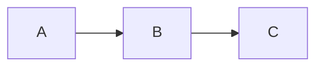

# MkDocs + MathJax Quick Reference

**Last Updated:** 2026-01-24

Quick reference for setting up and using MkDocs with MathJax for LaTeX rendering.

For detailed guide, see: [mkdocs_mathjax_setup_guide.md](mkdocs_mathjax_setup_guide.md)

---

## 5-Minute Setup

```bash
# 1. Create requirements
echo "mkdocs>=1.5.3
mkdocs-material>=9.5.3
pymdown-extensions>=10.7
mkdocs-jupyter>=0.24.6" > requirements-docs.txt

# 2. Install
pip install -r requirements-docs.txt

# 3. Create structure
mkdir -p docs/javascripts docs/stylesheets .github/workflows

# 4. Copy config files (see below)

# 5. Test
mkdocs serve

# 6. Deploy
mkdocs gh-deploy
```

---

## Essential Files

### 1. `requirements-docs.txt`

```txt
mkdocs>=1.5.3
mkdocs-material>=9.5.3
pymdown-extensions>=10.7
mkdocs-jupyter>=0.24.6
```

---

### 2. `mkdocs.yml` (Minimal)

```yaml
site_name: Your Project
site_url: https://username.github.io/repo-name/
repo_url: https://github.com/username/repo-name

theme:
  name: material
  palette:
    - scheme: default
      primary: indigo
      toggle:
        icon: material/brightness-7
        name: Dark mode
    - scheme: slate
      primary: indigo
      toggle:
        icon: material/brightness-4
        name: Light mode
  features:
    - navigation.instant
    - navigation.tabs
    - search.suggest
    - content.code.copy

markdown_extensions:
  - pymdownx.arithmatex:
      generic: true
  - pymdownx.highlight
  - pymdownx.superfences:
      custom_fences:
        - name: mermaid
          class: mermaid
          format: !!python/name:pymdownx.superfences.fence_code_format
  - admonition
  - pymdownx.details
  - tables
  - toc:
      permalink: true

extra_javascript:
  - javascripts/mathjax.js
  - https://polyfill.io/v3/polyfill.min.js?features=es6
  - https://cdn.jsdelivr.net/npm/mathjax@3/es5/tex-mml-chtml.js

extra_css:
  - stylesheets/extra.css

plugins:
  - search
  - mkdocs-jupyter

nav:
  - Home: index.md
  - Documentation: docs/
```

---

### 3. `docs/javascripts/mathjax.js`

```javascript
window.MathJax = {
  tex: {
    inlineMath: [['$', '$'], ["\\(", "\\)"]],
    displayMath: [['$$', '$$'], ["\\[", "\\]"]],
    processEscapes: true,
    processEnvironments: true,
    tags: 'ams'
  },
  options: {
    ignoreHtmlClass: 'tex2jax_ignore',
    processHtmlClass: 'tex2jax_process|arithmatex'
  }
};

document$.subscribe(() => { 
  MathJax.typesetPromise();
})
```

---

### 4. `.github/workflows/docs.yml`

```yaml
name: docs
on:
  push:
    branches: [main]
permissions:
  contents: write
jobs:
  deploy:
    runs-on: ubuntu-latest
    steps:
      - uses: actions/checkout@v4
      - uses: actions/setup-python@v5
      - run: pip install -r requirements-docs.txt
      - run: mkdocs gh-deploy --force
```

---

### 5. `.gitignore` (Add)

```gitignore
site/
docs/_build/
```

---

## Math Syntax

| Type | Markdown | Rendered |
|------|----------|----------|
| Inline | `$E = mc^2$` | $E = mc^2$ |
| Display | `$$E = mc^2$$` | (centered) |
| Fraction | `$\frac{a}{b}$` | $\frac{a}{b}$ |
| Subscript | `$x_i$` | $x_i$ |
| Superscript | `$x^n$` | $x^n$ |
| Greek | `$\alpha, \beta$` | $\alpha, \beta$ |
| Sum | `$\sum_{i=1}^n$` | $\sum_{i=1}^n$ |
| Integral | `$\int_0^\infty$` | $\int_0^\infty$ |
| Matrix | `$\begin{bmatrix}a\\b\end{bmatrix}$` | Column vector |

**Multi-line equations:**

```markdown
$$
\begin{align}
x &= a + b \\
y &= c + d
\end{align}
$$
```

---

## Common Commands

```bash
# Development
mkdocs serve              # Live preview at http://127.0.0.1:8000/
mkdocs build              # Build to site/
mkdocs build --strict     # Fail on warnings

# Deployment
mkdocs gh-deploy          # Deploy to GitHub Pages
mkdocs gh-deploy --force  # Force overwrite
```

---

## Writing Docs

### Code Blocks

````markdown
```python
def hello():
    print("Hello, World!")
```
````

**With line numbers:**

````markdown
```python linenums="1"
def hello():
    print("Hello")
```
````

---

### Admonitions

```markdown
!!! note
    Important information

!!! warning
    Be careful!

!!! tip
    Pro tip here
```

---

### Tables

```markdown
| Col 1 | Col 2 |
|-------|-------|
| A | B |
| C | D |
```

---

### Mermaid Diagrams

````markdown

````

---

### Links

```markdown
[Internal](page.md)
[External](https://example.com)
[Anchor](#section)
```

---

## GitHub Pages Setup

1. Run `mkdocs gh-deploy` (creates `gh-pages` branch)
2. Go to: Settings → Pages
3. Source: `gh-pages` branch, `/ (root)` folder
4. Save
5. Wait 5-10 minutes
6. Visit: `https://username.github.io/repo-name/`

---

## Troubleshooting

### Math not rendering?

1. Check `pymdownx.arithmatex: generic: true` in mkdocs.yml
2. Verify mathjax.js exists: `ls docs/javascripts/mathjax.js`
3. Clear browser cache: Ctrl+Shift+R

### Build fails?

```bash
# Validate YAML
python -c "import yaml; yaml.safe_load(open('mkdocs.yml'))"

# Build with strict mode
mkdocs build --strict
```

### Site not updating?

1. Check workflow: github.com/user/repo/actions
2. Hard refresh: Ctrl+Shift+R
3. Force deploy: `mkdocs gh-deploy --force`

---

## Project Structure

```
project/
├── docs/
│   ├── index.md
│   ├── javascripts/
│   │   └── mathjax.js
│   └── stylesheets/
│       └── extra.css
├── mkdocs.yml
├── requirements-docs.txt
├── .github/
│   └── workflows/
│       └── docs.yml
└── .gitignore
```

---

## Workflow

```
Edit docs/*.md → Test (mkdocs serve) → Push → Auto-deploy (2-3 min) → Live!
```

---

## Example: Complete Page

```markdown
# My Documentation

## Overview

This project solves $ax^2 + bx + c = 0$ using the quadratic formula:

$$
x = \frac{-b \pm \sqrt{b^2 - 4ac}}{2a}
$$

## Implementation

```python
import numpy as np

def solve_quadratic(a, b, c):
    """Solve quadratic equation."""
    discriminant = b**2 - 4*a*c
    x1 = (-b + np.sqrt(discriminant)) / (2*a)
    x2 = (-b - np.sqrt(discriminant)) / (2*a)
    return x1, x2
```

## Example

!!! example
    For $2x^2 + 3x - 2 = 0$:
    
    ```python
    x1, x2 = solve_quadratic(2, 3, -2)
    print(f"Solutions: {x1}, {x2}")
    # Solutions: 0.5, -2.0
    ```

## See Also

- [Installation](installation.md)
- [API Reference](api.md)
```

---

## Resources

- **MkDocs:** https://www.mkdocs.org/
- **Material:** https://squidfunk.github.io/mkdocs-material/
- **MathJax:** https://docs.mathjax.org/
- **Math Tutorial:** https://math.meta.stackexchange.com/questions/5020/

---

**For full details:** See [mkdocs_mathjax_setup_guide.md](mkdocs_mathjax_setup_guide.md)
